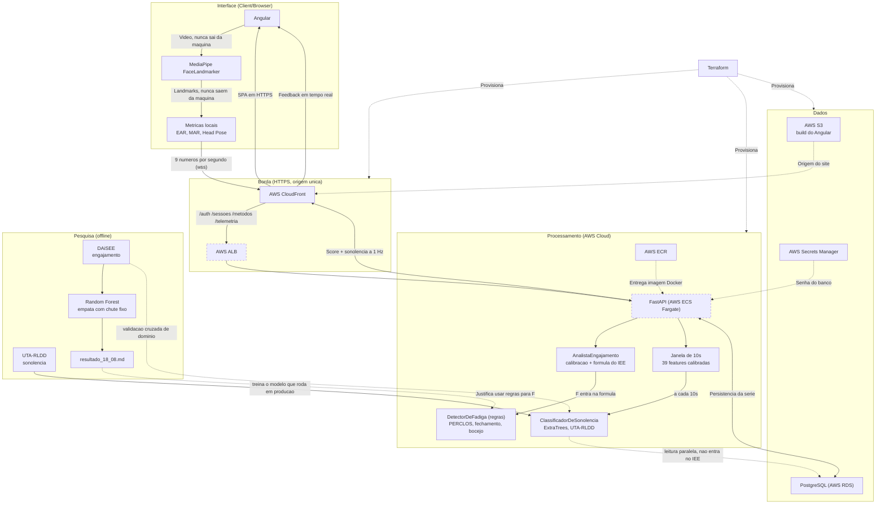

# Arquitetura

O desenho abaixo é o que **está no código**, não o que foi proposto. As quatro
diferenças em relação ao diagrama original estão explicadas logo depois, porque
cada uma é uma decisão que precisa ser defendida — e três delas foram forçadas
por coisas que só apareceram na implementação.

Tracejado = provisionamento e entrega (não é caminho de requisição).
Linha pontilhada em volta do nó = ainda não construído (ticket 15).



## O que mudou em relação ao diagrama original

### 1. CloudFront e ALB entraram — e não são enfeite

O diagrama original ligava `S3 -> Angular` direto, como "hospedagem estática".
**Isso não funciona.** O endpoint de site estático do S3 serve apenas HTTP, e o
navegador só libera `getUserMedia` em contexto seguro: o produto carregaria,
faria login, deixaria iniciar a sessão e falharia na única coisa que existe para
fazer — acender a webcam.

O ALB entrou pelo mesmo motivo, um passo adiante: com o site em HTTPS, o
WebSocket tem que ser `wss`, e página segura falando `ws` é conteúdo misto que o
navegador bloqueia sem perguntar.

E como o ACM **não emite certificado para o nome de um ALB**, HTTPS no
balanceador exigiria um domínio próprio, registrado e validado. A saída foi não
ter um segundo domínio: o ALB é **segundo origin do mesmo CloudFront**. O
navegador enxerga uma origem só, e disso saem três coisas de graça — não há
CORS, não há conteúdo misto, e não há URL de ambiente para o frontend errar.

### 2. Há um modelo em produção — mas não é o do DAiSEE, e não decide o `F`

O diagrama original mostrava `FastAPI <-> Random Forest` com a seta
**"Classificação de Fadiga"**: o modelo treinado no DAiSEE respondendo, a cada
segundo, quanto descontar do índice. **Esse caminho não existe**, e a razão está
medida em [`resultado_18_08.md`](./resultado_18_08.md): aquele modelo prevê
*engajamento*, e no split de teste ele **empata com um classificador que responde
sempre "engajado"**. O fator derivado dele seria constante, e a penalidade
viraria código morto.

O que aconteceu no lugar foram duas coisas, e elas são distintas.

**O fator `F` passou a vir de regras.** O
[`DetectorDeFadiga`](./backend/app/analista.py) mede PERCLOS, fechamento
prolongado e bocejo, com limiares relativos à baseline do próprio aluno. Fadiga
é estado físico observável — "a pálpebra ficou fechada por mais de dois
segundos" tem resposta objetiva, verificável e explicável a quem está sendo
medido. A ablação do modelo de sonolência confirma o desenho por medição: o
sinal está quase todo nos olhos, e as quatro features derivadas sozinhas chegam
a 0,6645 das 0,6688 obtidas com todas as 39.

**E um classificador de verdade entrou na aplicação**, treinado noutro dataset.
O UTA-RLDD tem 60 participantes gravando três estados declarados de sonolência,
e ali o modelo **discrimina**: 0,6553 ± 0,0180 de acurácia balanceada em
validação cruzada por participante, contra 0,50 de um chute fixo. Ele lê cada
janela de 10 segundos da sessão ao vivo, com a mesma calibração de 60 segundos
do IEE, e a leitura é gravada e mostrada no relatório.

**Ele não entra na fórmula, e a seta pontilhada no diagrama diz isso.** O índice
continua determinístico e auditável; a leitura do modelo é uma segunda opinião,
medida e apresentada com a acurácia ao lado. Promovê-la a decisão é uma linha de
código e uma conversa com a orientação — e há teste travando a separação: com e
sem modelo carregado, o score e o fator de fadiga saem idênticos.

O Random Forest do DAiSEE permanece em **Pesquisa**: é a evidência que justifica
a regra, e agora também o conjunto de validação cruzada de domínio do modelo que
roda em produção. Ver [`resultado_sonolencia.md`](./resultado_sonolencia.md).

### 3. Os landmarks não saem do navegador

A seta "Extração de Landmarks" ia do MediaPipe até `Communication`, o que, lido
ao pé da letra, diz que a geometria do rosto trafega para a nuvem.

O que trafega são **nove campos, uma vez por segundo**
([`agregacao.ts`](./frontend/src/app/core/telemetria/agregacao.ts)):

```ts
{ ear, ear_esq, ear_dir, mar, yaw, pitch, roll, rosto_detectado, incerteza }
```

Eram cinco até o classificador de sonolência entrar; os quatro novos são os
olhos separados e a pose completa, que é o que o modelo foi treinado para
receber. Todos são números derivados, do mesmo tipo dos anteriores.

Nenhum ponto facial, nenhum quadro. Os landmarks morrem no navegador depois de
virarem esses números. Esta diferença é a favor do projeto — e é justamente por
isso que o desenho precisava mudar: como estava, enfraquecia a defesa de
privacidade que é o eixo do trabalho.

### 4. Face Mesh virou FaceLandmarker

Mesma família, API diferente: o `FaceLandmarker` do MediaPipe Tasks Vision é o
sucessor do Face Mesh, e é o que está no `package.json`.
