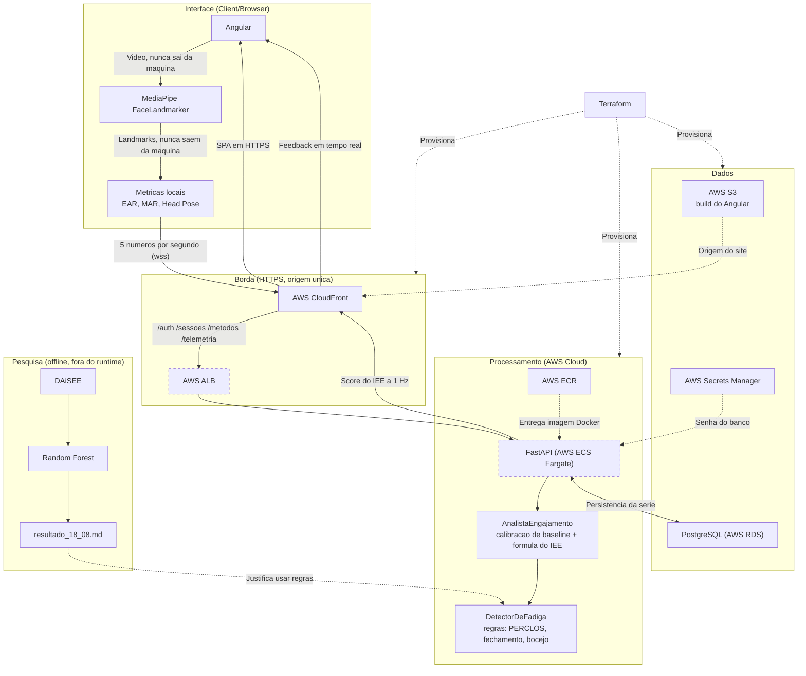

# Arquitetura

O desenho abaixo é o que **está no código**, não o que foi proposto. As quatro
diferenças em relação ao diagrama original estão explicadas logo depois, porque
cada uma é uma decisão que precisa ser defendida — e três delas foram forçadas
por coisas que só apareceram na implementação.

Tracejado = provisionamento e entrega (não é caminho de requisição).
Linha pontilhada em volta do nó = ainda não construído (ticket 15).



## O que mudou em relação ao diagrama original

### 1. CloudFront e ALB entraram — e não são enfeite

O diagrama original ligava `S3 -> Angular` direto, como "hospedagem estática".
**Isso não funciona.** O endpoint de site estático do S3 serve apenas HTTP, e o
navegador só libera `getUserMedia` em contexto seguro: o produto carregaria,
faria login, deixaria iniciar a sessão e falharia na única coisa que existe para
fazer — acender a webcam.

O ALB entrou pelo mesmo motivo, um passo adiante: com o site em HTTPS, o
WebSocket tem que ser `wss`, e página segura falando `ws` é conteúdo misto que o
navegador bloqueia sem perguntar.

E como o ACM **não emite certificado para o nome de um ALB**, HTTPS no
balanceador exigiria um domínio próprio, registrado e validado. A saída foi não
ter um segundo domínio: o ALB é **segundo origin do mesmo CloudFront**. O
navegador enxerga uma origem só, e disso saem três coisas de graça — não há
CORS, não há conteúdo misto, e não há URL de ambiente para o frontend errar.

### 2. O Random Forest saiu do runtime

O diagrama mostrava `FastAPI <-> Random Forest` com a seta **"Classificação de
Fadiga"**, dentro da camada de dados — um modelo consultado a cada segundo.

Esse caminho **não existe no código**, e a razão está medida em
[`resultado_18_08.md`](./resultado_18_08.md): o modelo treinado no DAiSEE prevê
*engajamento*, e no split de teste ele **empata com um classificador que responde
sempre "engajado"**. O fator de fadiga derivado dele seria constante, e a
penalidade viraria código morto.

O que está em produção é o [`DetectorDeFadiga`](./backend/app/analista.py):
PERCLOS, fechamento prolongado e bocejo, com limiares relativos à baseline do
próprio aluno. Fadiga é estado físico observável — "a pálpebra ficou fechada por
mais de dois segundos" tem resposta objetiva, verificável e explicável ao aluno.
Engajamento não é.

Por isso o Random Forest aparece acima em **Pesquisa**, ligado ao relatório e não
ao backend: ele é a evidência que justifica a regra, não um serviço.

### 3. Os landmarks não saem do navegador

A seta "Extração de Landmarks" ia do MediaPipe até `Communication`, o que, lido
ao pé da letra, diz que a geometria do rosto trafega para a nuvem.

O que trafega são **cinco campos, uma vez por segundo**
([`agregacao.ts`](./frontend/src/app/core/telemetria/agregacao.ts)):

```ts
{ ear, yaw, mar, rosto_detectado, incerteza }
```

Nenhum ponto facial, nenhum quadro. Os landmarks morrem no navegador depois de
virarem esses números. Esta diferença é a favor do projeto — e é justamente por
isso que o desenho precisava mudar: como estava, enfraquecia a defesa de
privacidade que é o eixo do trabalho.

### 4. Face Mesh virou FaceLandmarker

Mesma família, API diferente: o `FaceLandmarker` do MediaPipe Tasks Vision é o
sucessor do Face Mesh, e é o que está no `package.json`.
