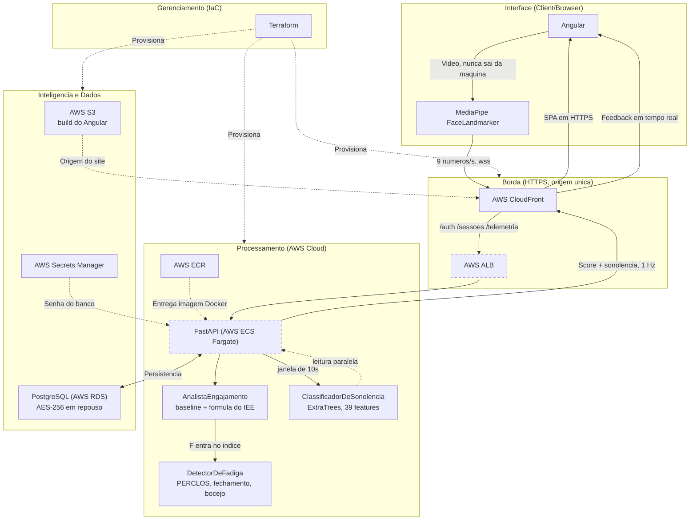
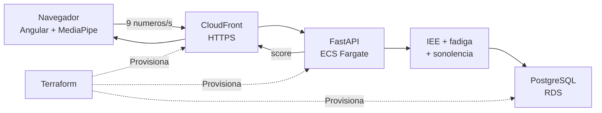

# Arquitetura em Mermaid — duas versões

Duas leituras do mesmo sistema, no formato enxuto do diagrama original. Sem a
camada de pesquisa offline: aqui está só o que roda.

A versão longa, com a trilha de ML e as divergências em relação ao pré-projeto,
está em [`arquitetura.md`](../arquitetura.md) na raiz.

---

## Versão 1 — completa

Abrange a arquitetura inteira: as quatro camadas do desenho original, mais a
borda HTTPS que o produto exige para existir.

**Como ler as setas.** Linha cheia é caminho de requisição; tracejada é
provisionamento ou leitura que não entra na conta. Nó com contorno tracejado
ainda não foi construído (ticket 15).

**As três coisas que o diagrama afirma:**

1. O vídeo para no navegador. Do `MediaPipe` para fora saem nove números.
2. O CloudFront é caminho obrigatório, não otimização — é ele que entrega o
   HTTPS sem o qual a webcam não liga.
3. O `ClassificadorDeSonolencia` tem seta tracejada de volta: ele **não** entra
   na fórmula do índice.

---

## Versão 2 — resumida

O sistema em seis caixas, para slide e para abertura de capítulo.

**A frase que acompanha este slide:** *o rosto é processado no navegador, o
servidor recebe só números, e a infraestrutura inteira sobe com um comando.*

---

## Nota de renderização

Os dois blocos foram renderizados com Mermaid 11 antes de entrar aqui. O GitHub
e o Mermaid Live Editor aceitam os dois como estão; para exportar em alta
resolução para a monografia, use o [Mermaid Live Editor](https://mermaid.live)
com fundo transparente e formato SVG.
